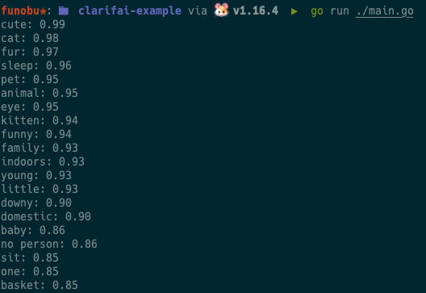

# Clarifai Go gRPC Client -- Example --

## Notes ✍🏻

- This is an example of Clarifai API.
- This repository is written in Japanese and Golang.

<br>
<br>

## 公式のコードの解説 (Getting started)

[公式のソースコードはこちら](face-sentiment-recognition)

### 1. パッケージのインストール

Clararifai の API にアクセスするには、gRPC と clarifai のパッケージが必要なのだ。<br>
インポートする際には以下のコマンドを使うのだ。

```bash
go get github.com/Clarifai/clarifai-go-grpc@latest github.com/joho/godotenv
```

### 2. パッケージのインポート

ここからは実際にコードを書いていく。<br>
まずは main.go のファイルを作成しよう。

<br>

各コードで外部パッケージを使うには、import 文の中に""でパッケージのパスを記載する。<br>
今回の場合は gRPC と clarifai と godotenv のパッケージを使うので、下記のように import 文に記載してあげる。

```go
package main

import (
	"context"
	"fmt"
	"log"
	"os"

	"github.com/Clarifai/clarifai-go-grpc/proto/clarifai/api"
	"github.com/Clarifai/clarifai-go-grpc/proto/clarifai/api/status"
	"github.com/joho/godotenv"
	"google.golang.org/grpc"
	"google.golang.org/grpc/credentials"
	"google.golang.org/grpc/metadata"
)
```

### 3. 環境変数の読み込み

clarifai の API で検証をするには **アプリケーションの API Key** と **モデルの ID** が必要になる。<br>
API Key は厳重に取り扱ってあげる必要があるので、コード内に直接記載せず、環境変数として定義してあげる。<br>
環境変数から API Key の値を参照することで、コードを他人に見られても API Key が知られることはない。(GitHub に公開しても安心！)<br>

環境変数についてもっと知りたい方はこちらのリンクよりどうぞ。
[環境変数について - envader](https://envader.plus/course/1/scenario/1015)

<br>

まずはカレントディレクトリに **.env** を作成しよう。<br>
そしたら、API_KEY と MODEL_ID をそれぞれ定義してあげる。
今回は `general-image-recognition` という標準のモデルを使うが、用途によって適宜変更してほしい。

```bash
API_KEY=APIキーの値
MODEL_ID=general-image-recognition
```

API_KEY と MODEL_ID はそれぞれ環境変数の名前となる。<br>
この.env は絶対に **git add しない** こと！

<br>

言語によっては .env を自動で読み取って環境変数として認識してくれることもあるが、Go の場合だと認識してくれない。<br>
そこで、先ほどインストールした **godotenv** というパッケージを使う。早速書いてみよう。<br>
ここからは **main 関数** に処理を書いていく。

```go
func main() {
	// NOTE: カレントディレクトリの.envを環境変数とする。
	err := godotenv.Load(".env")
	if err != nil {
		panic(err)
	}

	// NOTE: crarifaiを使うのに必要な情報を環境変数からアクセスする。(カレントディレクトリに.envを作ってそこに記載する。)
	var API_KEY = os.Getenv("API_KEY")
	var MODEL_ID = os.Getenv("MODEL_ID")
```

`godotenv.Load`というメソッドを使い、その引数に読み込んであげたい環境変数のファイルを指定する。(今回の場合は **.env** ) <br>
仮にエラーが起きた際は、`err` という変数に代入し、panic を起こすようにしてある。(アプリケーションを強制終了するメソッド ) <br>
環境変数の読み込みが終わったら、 `os.Getenv` を使って特定の名前の環境変数の値を変数として定義してあげよう。<br>
以上で clarifai を使うのに必要な情報の定義は完了なのだ！

### 4. gRPC を使って Clarifai と接続する。

必要な準備が整ったところで、gRPC を使って実際に Clarifai と接続してみる。<br>
gRPC とは Google が開発した通信プロトコルの一種で、API 間の通信によく使われている。
<br>

早速、gRPC を使って Clarifai と接続するコードを main 関数の中に追記していこう。

```go
	// NOTE: ここでclarifaiのAPIに対してgRPC通信を用いてコネクションを繋いでいる。
	conn, err := grpc.Dial(
		"api.clarifai.com:443",
		grpc.WithTransportCredentials(credentials.NewClientTLSFromCert(nil, "")),
	)
	if err != nil {
		log.Fatalf("ERROR: コネクションに失敗 (原因) -> %+v", err)
	}

	client := api.NewV2Client(conn)
```

`grpc.Dial` メソッドを使って Clarifai と接続し、そのコネクションを `conn` という変数に渡してあげる。<br>
エラーが起きた場合にはアプリケーションを異常終了するようにしている。<br>

<br>

無事に接続ができたら、`conn` を`apiV2Client` というメソッドの引数にして実行する。そしてそれを`client` という変数に渡してあげる。<br>
この`client` という変数を使って、実際に入力データに Clarifai の機械学習の機能を使うのだ！

<br>

gRPC を用いて Clarifai と接続はできたが、実際に機械学習を使うには **アプリケーションの API キ-** が必要になる。<br>
Clarifai と通信する際に API キーを使うには、 **Context** というものを使う。まずは実際にコードを書いてみよう。

```go
	// NOTE: ここでclarifaiのアプリケーションを使うために必要なAPI Keyの情報をctxに入れる。
	ctx := metadata.AppendToOutgoingContext(
		context.Background(),
		"Authorization", "Key "+API_KEY,
	)
```

`metadata.AppendToOutgoinContext` というメソッドを使うことで、Clarifai と接続する際に使う Context を作成することができる。<br>
`context.Background`を入れることで Go の新しい Context を作成し、それを第一引数に入れる。また、第二引数には `"Authorization""` を、第三引数には `"Key " + API_KEY` を入れることで、アプリケーションの API キーを Clarifai に渡すことができる。

これで Clarifai と接続する時に使う Context が完成した！

<br>

### 5. Clarifai の機能を使って画像解析をしてみる。

Clarifai の機械学習を使うための準備が整ったので、実際に画像解析をしてみよう。<br>
今回は以下の画像を入力データとして使ってみる。🐈


まずは入力画像の URL を変数として定義してあげる。

```go
inputUrl := "https://pbs.twimg.com/media/FQKrdbwaMAARkpl?format=jpg&name=large"
```

次に、作成した Context と入力データを使って、画像解析を行うためのリクエストを作成する。<br>
実際にコードを書いてみよう。

```go
	// NOTE: 先ほど作ったAPI Keyの情報(ctx)を第一引数に入れて、第二引数には検証したいモデルのIDと入力データの情報を入れる。
	response, err := client.PostModelOutputs(
		ctx,
		&api.PostModelOutputsRequest{
			ModelId: MODEL_ID,
			Inputs: []*api.Input{
				{
					Data: &api.Data{
						Image: &api.Image{
							Url: inputUrl,
						},
					},
				},
			},
		},
	)

	if err != nil {
		panic(err)
	}

	// NOTE: 返ってきたresponseで正常に検証できたかどうかを判定。できなかったらログとして出力する。
	if response.Status.Code != status.StatusCode_SUCCESS {
		log.Fatalf("ERROR: 異常なレスポンスを検知 (原因) -> %s", response)
	}
```

先ほど作成した`client` という変数にある `client.PostModelOutputs` というメソッドを使うことで、画像解析のリクエストを送ることができる。<br>
第一引数には先ほど作成した`ctx` という Context を、第二引数には`api.PostModelOutputsRequest` という struct 型を入れてあげる。<br>
第二引数の struct 型のフィールドの中にある `ModelId` には変数として定義した `MODEL_ID` を、Inputs の中には入力データを入れる。<br>
その際、今回は画像データを入力データとして指定してあげる。

<br>

リクエストを送った結果が`response`という変数に、リクエストをした際のエラーが`err`という変数に渡される。<br>
エラーがあった場合はアプリケーションを異常終了するようにしている。

<br>

また、次の行にはレスポンスの内容に異常がないかどうかを判定している。<br>
`response.Status.Code`の中にはレスポンスのステータスコードが入っていて、正常にできたか、異常が起きたかはこれを見ればわかる。<br>
異常なデータが返ってきた場合にはアプリケーションを異常終了にしている。

<br>

最後に、返ってきたレスポンスの内容を表示してあげよう。<br>
`response.Outputs[0].Data.Concepts` の中に 入力データがどういうものなのかを表した結果が入っている。<br>
`concept.Name` には Concept の名前が、 `concept.Value` にはパーセンテージがそれぞれある。<br>
例えば、`concept.Name`が`**cat**で`concept.Value`が**0.98**の場合、「98%の確率で猫」であることがわかる！

```go

	// NOTE: 認識できたConseptを順にログとして表示。
	for _, concept := range response.Outputs[0].Data.Concepts {
		fmt.Printf("%s: %.2f\n", concept.Name, concept.Value)
	}
}
```

これで画像解析をするための準備は整った！！ (疲れたね、うん。)

### 6. コードの実行

コードを実行してみよう。

```bash
go run ./main.go
```

下記のように出力される。<br>
割合として表示されるので、この画像は 99%の確率でかわいいらしい。私もそう思う。



## あとがき

Clarifai は 機械学習をする上では非常に楽しいサービスだと思うので、是非とも使ってみてほしい。<br>
私もより深く Clarifai を知るために、何かしらアプリケーションを作ってみようと思う。<br>

<br>
最後に、Clarifaiの存在を教えてくれた大学の友人に感謝！ありがとう！！
